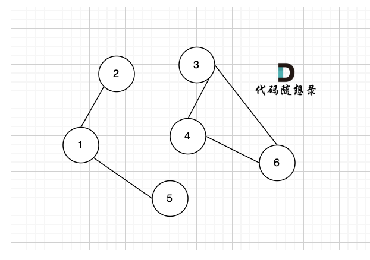
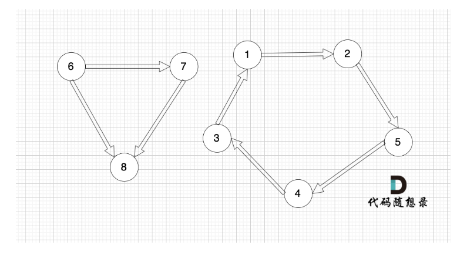
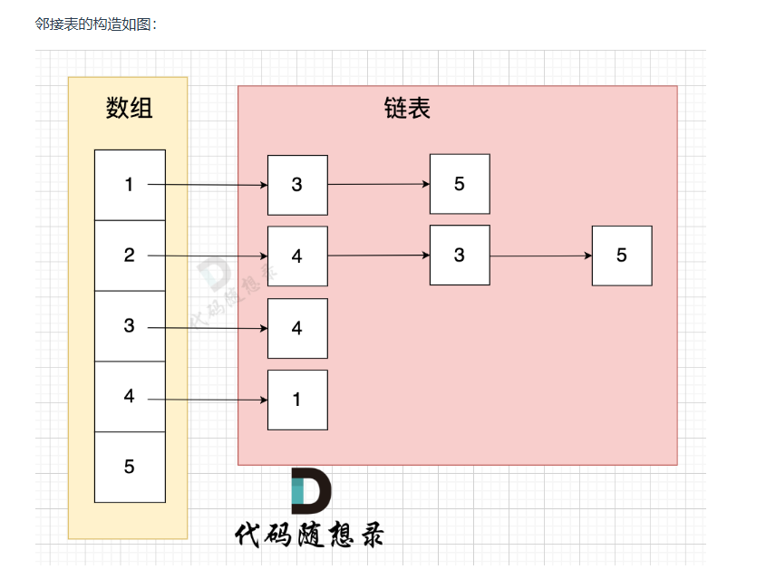

# 图的基本概念

## 连通分量
```
在无向图中的极大连通子图称之为该图的一个连通分量。
必须是极大连通子图才是连通分量
```

```
该无向图中 节点1、节点2、节点5 构成的子图就是 该无向图中的一个连通分量，该子图所有节点都是相互可达到的。
同理，节点3、节点4、节点6 构成的子图 也是该无向图中的一个连通分量。
那么无向图中 节点3 、节点4 构成的子图 是该无向图的联通分量吗？
不是！
因为必须是极大联通子图才能是连通分量，所以 必须是节点3、节点4、节点6 构成的子图才是连通分量。
```

## 强连通分量
```
在有向图中极大强连通子图称之为该图的强连通分量
强连通子图：节点之间必须可达的子图
```

```
节点1、节点2、节点3、节点4、节点5 构成的子图是强连通分量，因为这是强连通图，也是极大图。
节点6、节点7、节点8 构成的子图 不是强连通分量，因为这不是强连通图，节点8 不能达到节点6。
节点1、节点2、节点5 构成的子图 也不是 强连通分量，因为这不是极大图。
```

# 图的存储

## 邻接矩阵
```
优点：
1、表达方式简单，易于理解
2、检查任意两个顶点间是否存在边的操作非常快
3、适合稠密图，在边数接近顶点数平方的图中，邻接矩阵是一种空间效率较高的表示方法

缺点：
遇到稀疏图，会导致申请过大的二维数组造成空间浪费，且遍历边的时候需要遍历整个n * n矩阵，造成时间浪费
```

## 邻接表
```
邻接表 使用 数组 + 链表的方式来表示。 邻接表是从边的数量来表示图，有多少边 才会申请对应大小的链表。
```

```
这里表达的图是：

节点1 指向 节点3 和 节点5
节点2 指向 节点4、节点3、节点5
节点3 指向 节点4
节点4指向节点1
有多少边 邻接表才会申请多少个对应的链表节点。

从图中可以直观看出 使用 数组 + 链表 来表达 边的连接情况 。

邻接表的优点：
对于稀疏图的存储，只需要存储边，空间利用率高
遍历节点连接情况相对容易

缺点：
检查任意两个节点间是否存在边，效率相对低，需要 O(V)时间，V表示某节点连接其他节点的数量。
实现相对复杂，不易理解
```

# 深度优先搜索
## 代码框架

``` c++
void dfs(参数) {
    if (终止条件) {
        存放结果;
        return;
    }

    for (选择：本节点所连接的其他节点) {
        处理节点;
        dfs(图，选择的节点); // 递归
        回溯，撤销处理结果
    }
}
```

